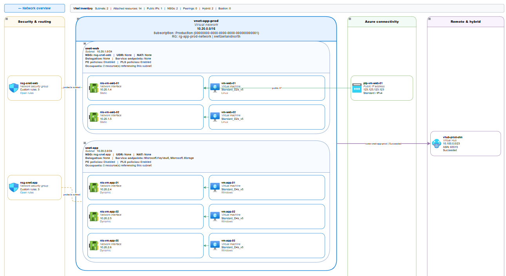
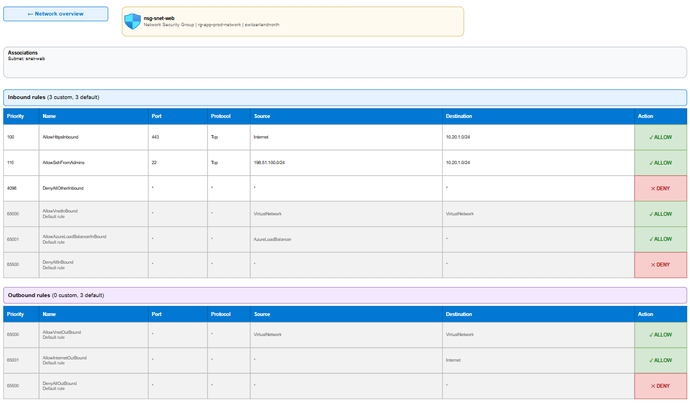

# VNetAtlas

VNetAtlas inventories Azure networking resources through Azure Resource Graph and creates
a browsable draw.io atlas with a network overview, one page per virtual network, and
optional detail pages for NSGs and route tables.


*VNet page showing subnet containment and connected Azure resources.*


*NSG detail page showing inbound and outbound security rules.*

## Quick start

VNetAtlas requires Windows PowerShell 5.1 or PowerShell 7+, the `Az.Accounts` and
`Az.ResourceGraph` modules, and at least Reader access to the subscriptions being queried.

```powershell
Install-Module -Name Az.Accounts, Az.ResourceGraph -Scope CurrentUser
Connect-AzAccount
.\Export-VNetAtlas.ps1
```

The command queries every enabled subscription available in the current tenant and creates
a timestamped `*_Azure-Network.drawio` file in the current directory. Open it in the draw.io
desktop application or at [app.diagrams.net](https://app.diagrams.net/).

## Key capabilities

- A network overview grouped by subscription, with links to individual VNet pages
- VNets and subnets containing their associated VMs, scale sets, NICs, and private endpoints
- Public IPs and prefixes, NAT gateways, load balancers, application gateways, Azure Firewalls, VPN
  gateways, Bastion hosts, and hybrid or Virtual WAN connectivity
- NSG, route-table, peering, backend, gateway, and other discovered relationships
- Optional detail pages for NSG rules, including application security group endpoints, and route-table routes
- An `Unmapped Resources` page for supported resources without a defensible VNet relationship
- Azure resource IDs stored as shape metadata and shown on hover
- Filterable tags and separate draw.io layers for connector classes
- Clickable VNet, NSG, and route-table shapes for navigation between pages
- Dynamic page sizing and editable, uncompressed draw.io XML

Resource labels include useful Azure metadata where available, such as VM size and OS,
private IP allocation, public IP SKU/FQDN, rule and route counts, gateway properties,
private endpoint state, and subnet delegation.

NSG detail tables show source and destination ports, address prefixes or application
security groups, and expose a rule's Azure description as a hover tooltip.

## Parameters

The script has four mutually exclusive parameter sets. `Azure` is the default and queries
live; `Input` regenerates a diagram from exported JSON; `Version` and `Help` print and exit.

| Parameter | Type | Set | Description |
| --- | --- | --- | --- |
| `-SubscriptionId` | `string[]` | Azure | Subscriptions to query. Omit to use every enabled subscription in the tenant. |
| `-TenantId` | `string` | Azure | Tenant to export. Forces a new sign-in when the current Az context uses another tenant. |
| `-ExportDataPath` | `string` | Azure | Also write normalized query results as JSON for offline reruns. |
| `-VnetName` | `string[]` | both | Include only matching VNet names. Wildcards are supported (`hub-*`). |
| `-ResourceGroup` | `string[]` | both | Include only VNets in matching resource groups. Wildcards are supported. |
| `-ExcludeSubscriptionId` | `string[]` | both | Exclude VNets in these subscriptions after applying `-SubscriptionId`. |
| `-InputDataPath` | `string` | Input (**required**) | Build from exported JSON instead of querying Azure. |
| `-OutputPath` | `string` | both | Target `.drawio` file. Defaults to `.\<yyyyMMdd_HHmm>_Azure-Network.drawio`. |
| `-ResourcesPerRow` | `int` | both | Resources per subnet row, from 1 to 4. Default: `2`. |
| `-SkipRuleDetailPages` | `switch` | both | Omit NSG and route-table detail pages. |
| `-SkipDefaultNsgRules` | `switch` | both | Omit Azure's built-in rules from NSG detail pages. |
| `-Quiet` | `switch` | both | Suppress the banner and progress output. The summary line and warnings are still written. |
| `-Verbose` | `switch` | Azure | Narrate subscription selection and each Resource Graph query. |
| `-Version` | `switch` | Version | Print `VNetAtlas <version>` and exit. |
| `-Help` | `switch` | Help | Print compact usage and exit. |

For full command help, run:

```powershell
Get-Help .\Export-VNetAtlas.ps1 -Full
```

## Examples

Export selected subscriptions:

```powershell
.\Export-VNetAtlas.ps1 `
    -SubscriptionId '00000000-0000-0000-0000-000000000001', '00000000-0000-0000-0000-000000000002' `
    -OutputPath .\azure-network.drawio
```

Export only matching VNets:

```powershell
.\Export-VNetAtlas.ps1 `
    -VnetName 'hub-*' `
    -OutputPath .\hub.drawio
```

Save the normalized results and regenerate the atlas offline:

```powershell
.\Export-VNetAtlas.ps1 `
    -ExportDataPath .\network-data.json `
    -OutputPath .\azure-network.drawio

.\Export-VNetAtlas.ps1 `
    -InputDataPath .\network-data.json `
    -OutputPath .\azure-network-offline.drawio
```

Relative output and data paths are resolved against PowerShell's current location. Use
`-TenantId` to select another tenant; different tenants must be exported separately.

## Supported resources and relationships

VNetAtlas currently queries and relates:

- Virtual networks, subnets, and VNet peerings
- VMs, VM scale sets, and network interfaces
- Public IP addresses and prefixes, NSGs, NAT gateways, and route tables
- Load balancers and application gateways, including frontend and backend relationships
- Azure Firewalls, private endpoints, and their target resources
- VPN/ExpressRoute gateways, connections, local gateways, and ExpressRoute circuits
- Azure Bastion hosts
- Virtual Hubs, hub VNet connections, and associated ExpressRoute gateways

A resource appears on a VNet page only when Azure Resource Graph exposes a subnet, NIC,
backend, peering, gateway connection, or Virtual WAN hub connection relationship. Other
supported resources appear on the `Unmapped Resources` page instead of being assigned by
inference.

Subnet references also identify VNet-injected services that are not queried directly, such
as Container Apps environments, App Service integration, flexible database servers, and
Private Link services. These shapes are labelled `Detected from subnet reference`.

### Scope and limitations

- `-VnetName`, `-ResourceGroup`, and `-ExcludeSubscriptionId` combine with AND and are
  applied before pages are built.
- With filters active, the network overview shows only the selected VNets, detail pages
  include only NSGs and route tables reachable from them, and the `Unmapped Resources` page
  is suppressed.
- If no VNet matches, the script stops without creating an empty diagram.
- Private DNS zones, VNet links, record sets, and private-endpoint DNS zone groups are not
  collected.
- Azure Resource Graph expands at most 2,000 subnets, peerings, or IP configurations per
  resource. The script warns when a resource reaches that limit.

## Diagram conventions

- Containment represents VNet, subnet, and subnet-resource membership.
- Solid green connectors represent attachments, public IPs, and load-balancer backends.
- Dashed gold connectors represent NSG associations.
- Dashed blue connectors represent routing and NAT configuration.
- Dashed purple connectors represent VNet peering; solid purple connectors represent VPN,
  ExpressRoute, and Virtual WAN hub connectivity.
- Connector classes use separate draw.io layers. Open **View > Layers** (`Ctrl+Shift+L`) to
  show or hide them.
- Subnets are collapsible, and **View > Tags** can filter shapes by kind, lane, name, or
  subnet.

Azure icons use draw.io's built-in `img/lib/azure2` library and render in the diagrams.net
web and desktop editors.

NSG detail pages resolve both address-prefix and application-security-group sources and
destinations. NAT gateway relationships include attached IPv4 and IPv6 public IP addresses
and public IP prefixes where Azure Resource Graph exposes them.

## Disclaimer

VNetAtlas was developed with AI assistance and may contain errors, omissions, or incomplete
mappings. It is intended as a supporting tool for security reviews and is not an
authoritative source of truth or a substitute for manual validation and professional
judgement.
