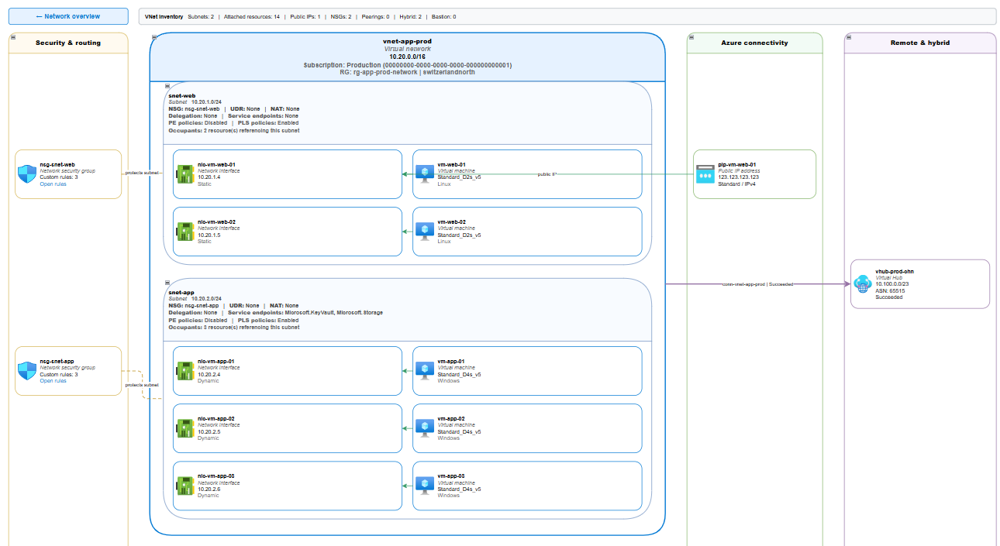
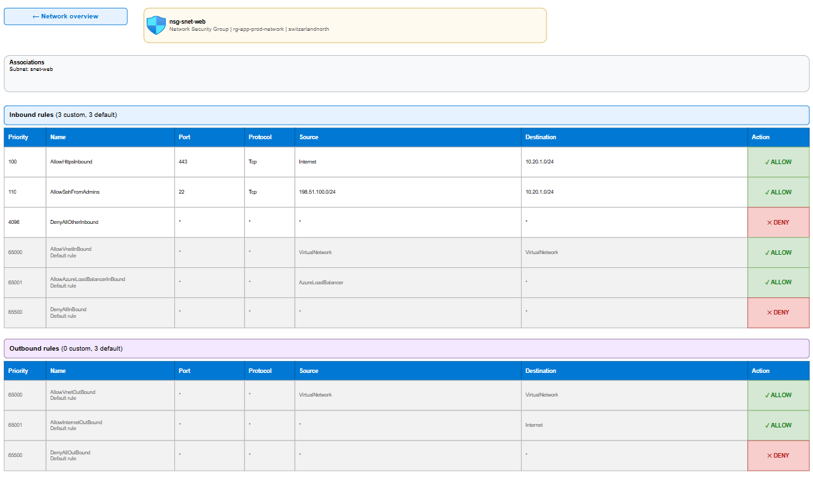

# VNetAtlas

**Map your Azure networks into an editable draw.io atlas without clicking through the portal.**

## Why VNetAtlas

As a security analyst, I've always found Azure network reviews tedious. In environments
without consistent naming or structure, things get chaotic quickly, and working out how a
network actually fits together can take a million clicks in the portal. More often than
not, I ended up drawing the network in draw.io by hand.

draw.io files are just XML, so I wondered how much of that drawing I could automate.
VNetAtlas is the answer. It signs in with the Az PowerShell modules, runs a set of KQL
queries against Azure Resource Graph, and writes the diagram I used to draw by hand:
VNets, subnets, peerings, the resources inside them, and everything attached to them, from
gateways and public IPs to NSGs with their full rule sets.

## A tour of the atlas

One command produces a single `.drawio` file that reads like an atlas: start with the big
picture and click your way down to the details.

**1. Network overview.** Every VNet, grouped by subscription, with its address space,
region, and peerings. Click a VNet to open its page.

**2. One page per VNet.** Subnets are drawn as containers holding what lives in them:
VMs, NICs, scale sets, private endpoints, VNet-injected services such as Container Apps
environments, and subnet-deployed services such as Application Gateway, Azure Firewall,
virtual network gateways, and Azure Bastion. Around the VNet, three lanes show what it
connects to:

- **Security & routing:** NSGs and route tables
- **Azure connectivity:** public IPs, NAT gateways, load balancers, and linked Azure
  resources that attach to or span the VNet
- **Remote & hybrid:** peered VNets, on-premises gateways, ExpressRoute circuits, and
  Virtual WAN hubs

Labels carry the details you would otherwise look up one blade at a time, such as VM size,
private IPs, public IP SKU and FQDN, subnet delegations, and private endpoint state. Hover
over any shape to see its Azure resource ID.


*VNet page showing subnet containment and connected Azure resources.*

**3. NSG and route-table pages.** Click an NSG to see its rules laid out the way the portal
lists them: inbound and outbound, custom and default, with application security groups
resolved and each rule's description shown on hover. Route tables get the same treatment.
Click an Azure Firewall to open its firewall policy page, with every rule collection group,
collection, and rule.


*NSG detail page showing inbound and outbound security rules.*

**4. Unmapped Resources.** Anything VNetAtlas found but could not tie to a VNet through a
relationship Azure actually reports, such as a public IP or an NSG that is not attached to
anything. VNetAtlas lists these instead of guessing where they belong, and they are often
worth a second look in a review.

The output is plain, uncompressed draw.io XML, so the atlas is a starting point rather than
a finished picture. Move shapes around, annotate your findings, or hide connector types
with draw.io layers.

## Made for reviews

- **Read-only.** VNetAtlas runs Resource Graph queries, plus read-only (`GET`) Azure
  Resource Manager requests for firewall policy rules. Reader access is enough.
- **Focus on what matters.** Narrow large tenants with `-VnetName`, `-ResourceGroup`, or
  `-ExcludeSubscriptionId`.

## Quick start

VNetAtlas requires Windows PowerShell 5.1 or PowerShell 7+, the `Az.Accounts` and
`Az.ResourceGraph` modules, and at least Reader access to the subscriptions being queried.

```powershell
Install-Module -Name Az.Accounts, Az.ResourceGraph -Scope CurrentUser
Connect-AzAccount
.\Export-VNetAtlas.ps1
```

The command queries every enabled subscription available in the current tenant and creates
a timestamped `*_Azure-Network.drawio` file in the current directory. Open it in the draw.io
desktop application or at [app.diagrams.net](https://app.diagrams.net/).

## Parameters

The script has four mutually exclusive parameter sets. `Azure` is the default and queries
live; `Input` regenerates a diagram from exported JSON; `Version` and `Help` print and exit.

| Parameter | Type | Set | Description |
| --- | --- | --- | --- |
| `-SubscriptionId` | `string[]` | Azure | Subscriptions to query. Omit to use every enabled subscription in the tenant. |
| `-TenantId` | `string` | Azure | Tenant to export. Forces a new sign-in when the current Az context uses another tenant. |
| `-ExportDataPath` | `string` | Azure | Also write normalized query results as JSON for offline reruns. |
| `-VnetName` | `string[]` | both | Include only matching VNet names. Wildcards are supported (`hub-*`). |
| `-ResourceGroup` | `string[]` | both | Include only VNets in matching resource groups. Wildcards are supported. |
| `-ExcludeSubscriptionId` | `string[]` | both | Exclude VNets in these subscriptions after applying `-SubscriptionId`. |
| `-InputDataPath` | `string` | Input (**required**) | Build from exported JSON instead of querying Azure. |
| `-OutputPath` | `string` | both | Target `.drawio` file. Defaults to `.\<yyyyMMdd_HHmm>_Azure-Network.drawio`. |
| `-ResourcesPerRow` | `int` | both | Resources per subnet row, from 1 to 4. Default: `2`. |
| `-SkipRuleDetailPages` | `switch` | both | Omit NSG, route-table, and firewall-policy detail pages. Firewall policy rules are still collected. |
| `-SkipFirewallRules` | `switch` | both | Do not read firewall policy rules and omit the firewall-policy detail pages. |
| `-SkipDefaultNsgRules` | `switch` | both | Omit Azure's built-in rules from NSG detail pages. |
| `-Quiet` | `switch` | both | Suppress the banner and progress output. The summary line and warnings are still written. |
| `-Verbose` | `switch` | Azure | Narrate subscription selection and each Resource Graph query. |
| `-Version` | `switch` | Version | Print `VNetAtlas <version>` and exit. |
| `-Help` | `switch` | Help | Print compact usage and exit. |

For full command help, run:

```powershell
Get-Help .\Export-VNetAtlas.ps1 -Full
```

## Examples

Export selected subscriptions:

```powershell
.\Export-VNetAtlas.ps1 `
    -SubscriptionId '00000000-0000-0000-0000-000000000001', '00000000-0000-0000-0000-000000000002' `
    -OutputPath .\azure-network.drawio
```

Export only matching VNets:

```powershell
.\Export-VNetAtlas.ps1 `
    -VnetName 'hub-*' `
    -OutputPath .\hub.drawio
```

Save the query results as JSON, so you can later rebuild the atlas with different options
(for example a single VNet or no default NSG rules) without querying Azure again:

```powershell
.\Export-VNetAtlas.ps1 `
    -ExportDataPath .\network-data.json `
    -OutputPath .\azure-network.drawio

.\Export-VNetAtlas.ps1 `
    -InputDataPath .\network-data.json `
    -OutputPath .\azure-network-offline.drawio
```

Relative output and data paths are resolved against PowerShell's current location. Use
`-TenantId` to select another tenant; different tenants must be exported separately.

## Supported resources and relationships

VNetAtlas currently queries and relates:

- Virtual networks, subnets, and VNet peerings
- VMs, VM scale sets, and network interfaces
- Public IP addresses and prefixes, NSGs, NAT gateways, and route tables
- Load balancers and application gateways, including frontend and backend relationships
- Azure Firewalls and their firewall policies, including parent policies
- Private endpoints and their target resources
- VPN/ExpressRoute gateways, connections, local gateways, and ExpressRoute circuits
- Azure Bastion hosts
- Virtual Hubs, hub VNet connections, and associated ExpressRoute gateways and secured-hub
  firewalls

A resource appears on a VNet page only when Azure Resource Graph exposes a subnet, NIC,
backend, peering, gateway connection, or Virtual WAN hub connection relationship. Other
supported resources appear on the `Unmapped Resources` page instead of being assigned by
inference.

Subnet references also identify VNet-injected services that are not queried directly, such
as Container Apps environments, App Service integration, flexible database servers, and
Private Link services. These shapes are labelled `Detected from subnet reference`.

### Firewall policy rules

Resource Graph does not return firewall policy rules, so VNetAtlas reads them with read-only
Azure Resource Manager requests: at least two per policy, including parent policies.
`-ExportDataPath` saves them for offline reruns, and `-SkipFirewallRules` skips them. If a
policy cannot be read, its page says so and the export continues.

Not shown: classic rules on firewalls without a policy, the addresses inside IP groups, and
policies that no firewall uses.

### Scope and limitations

- `-VnetName`, `-ResourceGroup`, and `-ExcludeSubscriptionId` combine with AND and are
  applied before pages are built.
- With filters active, the network overview shows only the selected VNets, detail pages
  include only NSGs, route tables, and firewall policies reachable from them, and the
  `Unmapped Resources` page is suppressed.
- If no VNet matches, the script stops without creating an empty diagram.
- Private DNS zones, VNet links, record sets, and private-endpoint DNS zone groups are not
  collected.
- Azure Resource Graph expands at most 2,000 subnets, peerings, or IP configurations per
  resource. The script warns when a resource reaches that limit.

## Diagram conventions

- Containment represents VNet, subnet, and subnet-resource membership.
- Solid green connectors represent attachments, public IPs, and load-balancer backends.
- Dashed gold connectors represent NSG associations.
- Dashed blue connectors represent routing and NAT configuration.
- Dashed purple connectors represent VNet peering; solid purple connectors represent VPN,
  ExpressRoute, and Virtual WAN hub connectivity.
- Connector classes use separate draw.io layers. Open **View > Layers** (`Ctrl+Shift+L`) to
  show or hide them.
- Subnets are collapsible, and **View > Tags** can filter shapes by kind, lane, name, or
  subnet.
- The atlas follows draw.io's light and dark mode.

Azure icons use draw.io's built-in `img/lib/azure2` library and render in the diagrams.net
web and desktop editors.

NSG detail pages resolve both address-prefix and application-security-group sources and
destinations. NAT gateway relationships include attached IPv4 and IPv6 public IP addresses
and public IP prefixes where Azure Resource Graph exposes them.

## Disclaimer

VNetAtlas was developed with AI assistance and may contain errors, omissions, or incomplete
mappings. It is intended as a supporting tool for security reviews and is not an
authoritative source of truth or a substitute for manual validation and professional
judgement.
